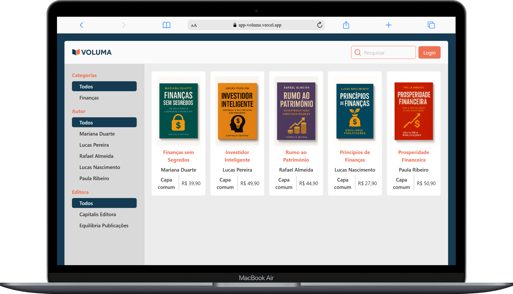

# App - Voluma (Em desenvolvimento)

## Descrição
Este projeto foi desenvolvido para aprimorar minhas habilidades como desenvolvedor fullstack, colocando em prática conceitos e tecnologias que domino.

## O que é o Voluma ?
O Voluma é uma livraria online fictícia criada para oferecer livros de diversas categorias, reunindo conhecimento e entretenimento em um só lugar.

## Objetivos:
- Mostrar minhas habilidades técnicas com HTML, CSS, JS, React, Node, Express, Axios, CORS, MongoDB Atlas, Cloudinary e mais.
- Aplicar princípios de Clean Code, organização de pastas e mais.
- Ajudar iniciantes com códigos simples, legíveis e prontos para estudo.
- Apresentar meu estilo de trabalho para recrutadores e empresas de tecnologia.

## Funcionalidades
- [x] Sidebar com alguns filtros de livros. (Mais filtros em desenvolvimento)
- [x] Layout responsivo para Desktop, Tablet e Mobile.

## Tecnologias Utilizadas
### Frontend
- **HTML** – Estrutura das páginas da aplicação.
- **CSS** – Estilização dos componentes e layout responsivo.
- **JavaScript** – Lógica de interatividade e funcionalidades.
- **React** – Biblioteca para construção de interfaces de usuário reativas.
- **Vite** – Ferramenta de build ultrarrápida usada para desenvolver o frontend com React.
- **Axios** – Comunicação com o backend por meio de requisições HTTP.
- **Vercel** – Plataforma usada para o deploy do frontend com CI/CD integrado.

### Backend
- **Node.js** – Ambiente de execução para JavaScript no lado do servidor.
- **Express** – Framework para criação das rotas e lógica do servidor.
- **CORS** – Middleware que permite comunicação entre diferentes origens (frontend ↔ backend).
- **Render** – Plataforma utilizada para o deploy do backend com suporte a variáveis de ambiente e deploy contínuo.

### Serviços e Integrações
- **MongoDB Atlas** – Banco de dados NoSQL na nuvem usado para armazenar as informações da aplicação.
- **Cloudinary** – Plataforma de upload e gerenciamento de imagens, usada para armazenar as capas dos livros.

## 📸 Screenshots

  <h3>Versão para Desktop (Em desenvolvimento)</h3>
  
  

 

  <h3>Versão para Tablet (Em desenvolvimento)</h3>
<!--    -->

 

  <h3>Versão para Mobile (Em desenvolvimento)</h3>
<!--    -->

##  Como rodar o projeto localmente
(Em desenvolvimento)

## Instalar as dependências 
(Em desenvolvimento)

## 📁 Estrutura de Pastas
(Em desenvolvimento)

## Deploy (Frontend)
O projeto está disponível online através do Vercel:
[Voluma - Livraria Online](https://app-voluma.vercel.app/)  
*Uma livraria fictícia para explorar livros de diversas categorias.*

## Deploy (Backend), Banco de Dados e API
**Banco de Dados**: A aplicação utiliza o **MongoDB Atlas**, uma solução de banco de dados na nuvem altamente escalável e segura.
**API**: O backend da aplicação está hospedado na plataforma **Render**, responsável por executar e disponibilizar a API de forma confiável.

## Contato
Sinta-se à vontade para me contatar através dos links abaixo: 
E-mail - jcddsj01@outlook.com 
Linkedin - https://www.linkedin.com/in/jose-carlos-703821254/

## Licença 
MIT License. Você pode usar este projeto como referência para criar o seu próprio portfólio.
